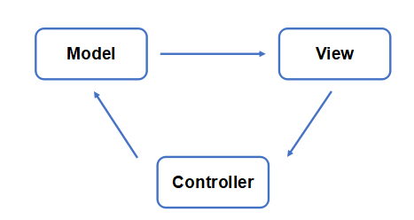
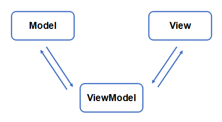

MVVM 是由 MVC 发展而来，通过在 Model 之上而在 View 之下增加一个非视觉的组件将来自 Model 的数据映射到 View 中。

<!--more-->

### MVC(Model-View-Controller)

- 视图（View）：用户界面，展示 UI 界面和响应用户交互
- 控制器（Controller）：业务逻辑，监听模型数据的改变和控制视图行为、处理用户交互
- 模型（Model）：数据保存

简单来说就是通过 controller 的控制去操作 model 层的数据，并且返回给 view 层展示。

- View 接受用户交互请求
- View 将请求转交给 Controller 处理
- Controller 操作 Model 进行数据更新保存
- 数据更新保存之后，Model 会通知 View 更新
- View 更新，用户得到反馈

### MVVM(Model-View-ViewModel)

MVVM 是在 MVC 模式之后引出的新的开发模式，他与 MVC 模式一样用于把视图（界面）和数据进行解耦，不同的是采用 ViewModel 来完成数据与视图的双向绑定，通过自动化的方式承担大部分数据工作，来解决由于界面复杂化和快速迭代带来的问题。
MVVM 将其中的 View 的状态和行为抽象化，让我们可以将 UI 和业务逻辑分开。MVVM 的优点是低耦合、可重用性、独立开发。

- View 接收用户交互请求
- View 将请求转交给 ViewModel
- ViewModel 操作 Model 数据更新
- Model 更新完数据，通知 ViewModel 数据发生变化
- ViewModel 更新 View 数据

### 不同之处

MVVM 模式和 MVC 有些类似，但有以下不同：

- ViewModel 替换了 Controller，在 UI 层之下
- ViewModel 向 View 暴露它所需要的数据和指令对象
- ViewModel 接收来自 Model 的数据
