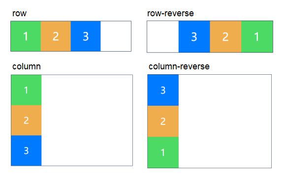
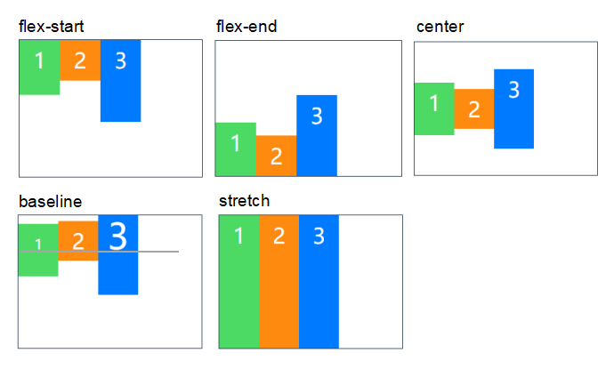
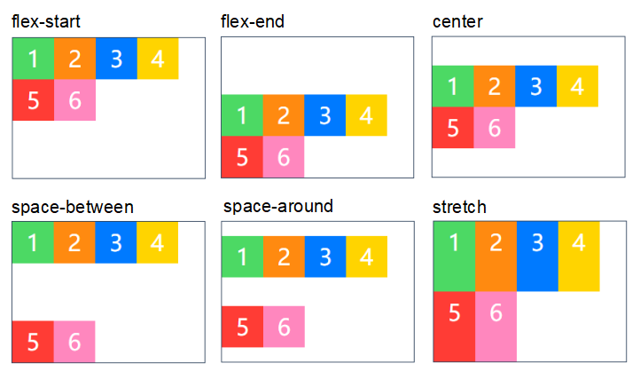

flex（ Flexible Box：弹性布局盒模型），用来为盒模型提供最大的灵活性。任何一个容器都可以指定为 Flex 布局。可以做到简便、完整、响应式地实现各种页面布局。

### 使用 flex 布局的优势

1. 可在不同方向排列元素
2. 控制元素排序的方向
3. 控制元素的对齐方式
4. 控制元素之间等距

<!--more-->

### 基本概念

1. flex container: Flex 容器
2. flex item: Flex 项目（元素）
3. flex direction: 布局方向

Flex 容器的所有子元素自动成为 Flex 项目。

在 flex 容器中默认存在两条轴，主轴(main axis) 和交叉轴(cross axis)，默认水平方向为主轴，垂直方向为交叉轴，也可以通过修改使垂直方向变为主轴，水平方向变为交叉轴。

### Flex 容器的属性

##### 1. flex-direction: 决定主轴的方向（元素的排列方向）

```css
.container {
  flex-direction: row | row-reverse | column | column-reverse;
}
```

row（默认）：主轴为水平方向，起点在左端。
row-reverse：主轴为水平方向，起点在右端。
column：主轴为垂直方向，起点在上沿。
column-reverse：主轴为垂直方向，起点在下沿。



##### 2. flex-wrap: 决定容器内项目是否可换行

```css
.container {
  flex-wrap: nowrap | wrap | wrap-reverse;
}
```

nowrap（默认）：不换行。
wrap：换行，第一行在上方。
wrap-reverse：换行，第一行在下方。


##### 3. justify-content：定义了项目在主轴的对齐方式

```css
.container {
  justify-content: flex-start | flex-end | center | space-between | space-around;
}
```

flex-start（默认）：左对齐
flex-end：右对齐
center： 居中
space-between：两端对齐，项目之间的间隔都相等，剩余空间等分成间隙
space-around：每个项目两侧的间隔相等，所以项目之间的间隔比项目与边缘的间隔大一倍。


##### 4. align-items: 定义了项目在交叉轴上的对齐方式

```css
.container {
  align-items: flex-start | flex-end | center | baseline | stretch;
}
```

flex-start：交叉轴的起点对齐。
flex-end：交叉轴的终点对齐。
center：交叉轴的中点对齐。
baseline: 项目的第一行文字的基线对齐。
stretch（默认值）：如果项目未设置高度或设为 auto，将占满整个容器的高度。



##### 5. align-content: 定义了多根轴线的对齐方式（如果项目只有一根轴线，那么该属性将不起作用）

```css
.container {
  align-content: flex-start | flex-end | center | space-between | space-around |
    stretch;
}
```

flex-start：与交叉轴的起点对齐。
flex-end：与交叉轴的终点对齐。
center：与交叉轴的中点对齐。
space-between：与交叉轴两端对齐，轴线之间的间隔平均分布。
space-around：每根轴线两侧的间隔都相等。所以，轴线之间的间隔比轴线与边框的间隔大一倍。
stretch（默认值）：轴线占满整个交叉轴。



### Flex 项目属性

##### 1. order：控制元素顺序

定义项目的排列顺序。数值越小，排列越靠前，默认为 0。可以为负

##### 2. flex-grow: 控制元素放大比例

定义项目的放大比例，默认为 0，值为 0 时不进行放大。

如果所有项目的 flex-grow 属性都为 1，则它们将等分剩余空间。(如果有的话)

如果一个项目的 flex-grow 属性为 2，其他项目都为 1，则前者占据的剩余空间将比其他项多一倍。

##### 3. flex-shrink: 控制元素缩小比例

定义了项目的缩小比例，默认为 1，即如果空间不足，该项目将缩小，负值对该属性无效。设置为 0 时不缩小。

- 如果所有项目的 flex-shrink 属性都为 1，当空间不足时，都将等比例缩小。

- 如果一个项目的 flex-shrink 属性为 0，其他项目都为 1，则空间不足时，前者不缩小。

##### 4. flex-basis: 设置元素固定或自动空间的占比

定义了在分配多余空间之前，项目占据的主轴空间，浏览器根据这个属性，计算主轴是否有多余空间。它的默认值为 auto，即项目的本来大小，这时候 item 的宽高取决于 width 或 height 的值。若值为 0，则必须加上单位，以免被视作伸缩性。

当主轴为水平方向的时候，当设置了 flex-basis，项目的宽度设置值会失效，flex-basis 需要跟 flex-grow 和 flex-shrink 配合使用才能发挥效果。

- 当 flex-basis 值为 0 % 时，是把该项目视为零尺寸的，故即使声明该尺寸为 140px，也并没有什么用。
- 当 flex-basis 值为 auto 时，则跟根据尺寸的设定值(假如为 100px)，则这 100px 不会纳入剩余空间。

##### 5. align-self:重写 align-item 父属性

允许单个项目有与其他项目不一样的对齐方式。
默认值为 auto，表示继承父元素的 align-items 属性，如果没有父元素，则等同于 stretch。

```css
.item {
  align-self: auto | flex-start | flex-end | center | baseline | stretch;
}
```
