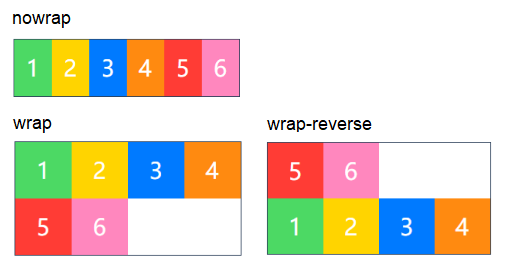

Flexible Box 模型

### 使用 flex 布局的优势

1. 可在不同方向排列元素
2. 控制元素排序的方向
3. 控制元素的对齐方式
4. 控制元素之间等距

### 基本概念

1. flex container: Flex 容器
2. flex item: Flex 项目（元素）
3. flex direction: 布局方向

Flex 容器的所有子元素自动成为 Flex 项目。

在 flex 容器中默认存在两条轴，主轴(main axis) 和交叉轴(cross axis)，默认水平方向为主轴，垂直方向为交叉轴，也可以通过修改使垂直方向变为主轴，水平方向变为交叉轴。

### Flex 容器的属性

##### 1. flex-direction: 决定主轴的方向（元素的排列方向）

```css
.container {
  flex-direction: row | row-reverse | column |
    column-reverse;
}
```

row（默认）：主轴为水平方向，起点在左端。
row-reverse：主轴为水平方向，起点在右端。
column：主轴为垂直方向，起点在上沿。
column-reverse：主轴为垂直方向，起点在下沿。


##### 2. flex-wrap: 决定容器内项目是否可换行

```css
.container {
  flex-wrap: nowrap | wrap | wrap-reverse;
}
```

nowrap（默认）：不换行。
wrap：换行，第一行在上方。
wrap-reverse：换行，第一行在下方。



##### 3. justify-content：定义了项目在主轴的对齐方式

```css
.container {
  justify-content: flex-start | flex-end | center |
    space-between | space-around;
}
```

flex-start（默认）：左对齐
flex-end：右对齐
center： 居中
space-between：两端对齐，项目之间的间隔都相等，剩余空间等分成间隙
space-around：每个项目两侧的间隔相等，所以项目之间的间隔比项目与边缘的间隔大一倍。


##### 4. align-items: 定义了项目在交叉轴上的对齐方式

```css
.container {
  align-items: flex-start | flex-end | center | baseline |
    stretch;
}
```

flex-start：交叉轴的起点对齐。
flex-end：交叉轴的终点对齐。
center：交叉轴的中点对齐。
baseline: 项目的第一行文字的基线对齐。
stretch（默认值）：如果项目未设置高度或设为 auto，将占满整个容器的高度。


##### 5. align-content: 定义了多根轴线的对齐方式，如果项目只有一根轴线，那么该属性将不起作用

--未完--
